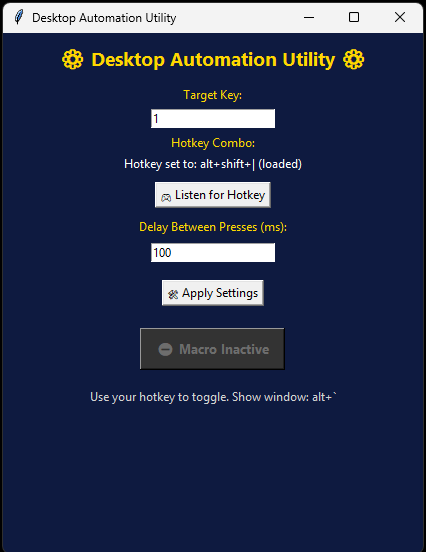

# Desktop Automation Utility

A configurable hotkey-driven desktop automation utility built in Python.  
Supports a toggleable press loop with adjustable delay and audio feedback for start and stop actions.

---

## Screenshot



---

## Features

- Global hotkey to toggle automation on and off  
- Configurable target key and delay (milliseconds)  
- Settings saved to a local configuration file  
- Non-blocking sound feedback on activation and deactivation  
- Simple graphical interface for quick adjustments  

---

## Technologies Used

- Python 3  
- Tkinter (GUI)  
- keyboard (global hotkeys)  
- pyautogui (simulated key presses)  
- Pillow (image support for UI)  
- playsound (audio feedback)  

---

## How to Run

### 1. Clone the repository

```bash
git clone https://github.com/zachattack85/desktop-automation-utility.git
cd desktop-automation-utility
```

### 2. Install dependencies

```bash
pip install -r requirements.txt
```

### 3. Run the application

```bash
python main.py
```

---

## Notes

This tool is intended for personal automation and productivity use.  
Use responsibly and in accordance with the terms of service of any application where automation is applied.

---

## License

This project is licensed under the MIT License.
